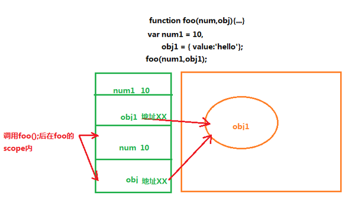

# javascript传递参数如果是object的话，是按值传递还是按引用传递？

>以下摘自知乎[苏墨橘](https://www.zhihu.com/question/27114726/answer/35481766)的回答。

## 数据类型

### 在 javascript 中数据类型可以分为两类：

+ 原始数据类型值 primitive type，比如Undefined,Null,Boolean,Number,String。
+ 引用类型值，也就是对象类型 Object type,比如Object,Array,Function,Date等。

### 声明变量时不同的内存分配

+ 原始值：存储在栈（stack）中的简单数据段，也就是说，它们的值直接存储在变量访问的位置。这是因为这些原始类型占据的空间是固定的，所以可将他们存储在较小的内存区域 – 栈中。这样存储便于迅速查寻变量的值。

+ 引用值：存储在堆（heap）中的对象，也就是说，存储在变量处的值是一个指针（point），指向存储对象的内存地址。这是因为：引用值的大小会改变，所以不能把它放在栈中，否则会降低变量查寻的速度。相反，放在变量的栈空间中的值是该对象存储在堆中的地址。地址的大小是固定的，所以把它存储在栈中对变量性能无任何负面影响。

### 不同的内存分配机制也带来了不同的访问机制

在javascript中是不允许直接访问保存在堆内存中的对象的，所以在访问一个对象时，首先得到的是这个对象在堆内存中的地址，然后再按照这个地址去获得这个对象中的值，这就是传说中的按引用访问。而原始类型的值则是可以直接访问到的。

### 复制变量时的不同

+ 原始值：在将一个保存着原始值的变量复制给另一个变量时，会将原始值的副本赋值给新变量，此后这两个变量是完全独立的，他们只是拥有相同的value而已。

+ 引用值：在将一个保存着对象内存地址的变量复制给另一个变量时，会把这个内存地址赋值给新变量，也就是说这两个变量都指向了堆内存中的同一个对象，他们中任何一个作出的改变都会反映在另一个身上。（这里要理解的一点就是，复制对象时并不会在堆内存中新生成一个一模一样的对象，只是多了一个保存指向这个对象指针的变量罢了）

### 参数传递的不同

首先我们应该明确一点：ECMAScript中所有函数的参数都是按值来传递的。但是为什么涉及到原始类型与引用类型的值时仍然有区别呢，还不就是因为内存分配时的差别。 （我对比了一下，这里和复制变量时遵循的机制完全一样的嘛，你可以简单地理解为传递参数的时候，就是把实参复制给形参的过程）

+ 原始值：只是把变量里的值传递给参数，之后参数和这个变量互不影响。

+ 引用值：对象变量它里面的值是这个对象在堆内存中的内存地址，这一点你要时刻铭记在心！因此它传递的值也就是这个内存地址，这也就是为什么函数内部对这个参数的修改会体现在外部的原因了，因为它们都指向同一个对象呀。或许我这么说了以后你对书上的例子还是有点不太理解，那么请看图吧：
  
  
  
  所以，如果是按引用传递的话，是把第二格中的内容（也就是变量本身）整个传递进去（就不会有第四格的存在了）。但事实是变量把它里面的值传递（复制）给了参数，让这个参数也指向原对象。因此如果在函数内部给这个参数赋值另一个对象时，这个参数就会更改它的值为新对象的内存地址指向新的对象，但此时原来的变量仍然指向原来的对象，这时候他们是相互独立的；但如果这个参数是改变对象内部的属性的话，这个改变会体现在外部，因为他们共同指向的这个对象被修改了呀！来看下面这个例子吧：（传说中的call by sharing）
  
  ```
  var obj1 = {
    value:'111'
  };
   
  var obj2 = {
    value:'222'
  };
   
  function changeStuff(obj){
    obj.value = '333';
    obj = obj2;
    return obj.value;
  }
   
   
  var foo = changeStuff(obj1);
   
  console.log(foo);// '222' 参数obj指向了新的对象obj2
  console.log(obj1.value);//'333'
  
  /* obj1仍然指向原来的对象,之所以value改变了,
   *是因为changeStuff里的第一条语句，这个时候obj是指向obj1的 .
   *再啰嗦一句，如果是按引用传递的话，这个时候obj1.value应该是等于'222'的
  */
  ```
  
  好了，以上就是关于这个问题的全部解释了。
  
  各位有兴趣的话可以去了解一下call by value ,call by reference call by sharing 等函数传递的机制[call by sharing](https://link.zhihu.com/?target=http%3A//en.wikipedia.org/wiki/Evaluation_strategy%23Call_by_sharing)
  
  还有stackoverflow上对于函数传递的这个问题解释得相当精辟，值得一看。（下面有链接）
  
  参考：
  
  + [ECMAScript 原始值和引用值](http://www.w3school.com.cn/js/pro_js_value.asp)
  + [stackoverflow对于函数传递问题的解释： Is JavaScript a pass-by-reference or pass-by-value language?](http://stackoverflow.com/questions/518000/is-javascript-a-pass-by-reference-or-pass-by-value-language?lq=1)
  + 我的红宝书《javascript高级程序设计》P69-P71
  
<br>