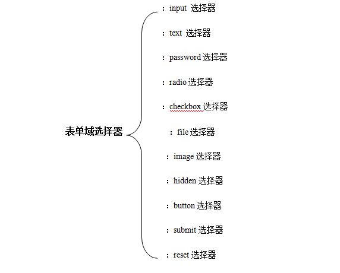
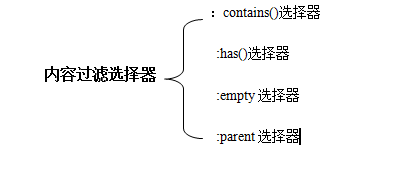

# jQuery选择器

## 一、基本分类

jQuery选择器大致可以分为两类，基本选择器和过滤选择器,总体结构体系如下:

## 二、基本选择器

基本选择器又可以分为三种,分别为：

+ CSS选择器
+ 层级选择器
+ 表单域选择器

### 2.1 CSS选择器

jQuery借用一套CSS选择器，共5种。

#### 2.1.1 标签选择器

> 用于选择HTML页面已有的标签元素，也称元素选择器。

　　格式： `$("element")`

　　例： `$("div")`

#### 2.1.2 ID选择器

> 用于获取某个具有ID属性的元素。

　　格式： `$("id")`

　　例：   `$("#id").val();`

#### 2.1.3 类选择器

> 获取某个具有class属性的元素。

　　格式： `$("class")`

　　例： `$(".t").css("border","2px solid blue");`

#### 2.1.4 通用选择器

> 通用选择器（*）匹配所有元素，多用于结合上下文来搜索。

　　格式： `$("*")`

　　例： `$("*").css("color","red");`

#### 2.1.5 群组选择器

> 又称多元素选择器，用于选择所有指定的选择器组合的结果。

　　格式： `$("selector,selector2,......,selectorN")`

　　例： `$("div,span,p.styleClass").css("border","2px solid blue");`

### 2.2 层级选择器

在HTML方档中，每个元素总是处在DOM节点树上的某个位置，文档层次结构中元素之间总是存在着某种层级关系。

#### 2.2.1 子元素选择器

> 用于在给定的父元素下查找其下面的所有子元素。

　　格式： `$("parent>child")`

　　例： `$("form > input"); `    

匹配form表单中所有的子级input元素。

#### 2.2.2 后代选择器

> 用于在给定的祖先元素下匹配所有的后代元素。

　　格式： `$("ancestor descendant")`

　　例： `$("form input");`
     
查找form元素的后代元素中为input的标记。

#### 2.2.3 紧邻同辈选择器

> 用于匹配所有紧接在某元素后的第一个元素。

　　格式： `$("prev+next")`

　　例： `$("div+span"); `    

匹配所有跟在div后的span元素。

#### 2.2.4 相邻同辈选择器

> 用于匹配某元素后面的所有同辈元素。

　　格式： `$("prev~slblings")`

　　例： `$("input~p").css("color","red");`

### 2.3 表单域选择器

表单域指网页中的`input,textareaselect,button`元素。jQuery 表单域选择器专门用于从文档中选择表单域。

#### 2.3.1 :input选择器

> 用于选择所有`input,textareaselect,button`元素。

　　格式： `$(":input")`

#### 2.3.2 :text选择器

> 用于选择所有单行文本框`<input type="text"/>`

　　格式： `$(":text")`

#### 2.3.3 :password选择器

> 用于选择所有密码框`<input type="password"/>`

　　格式： `$(":password")`

#### 2.3.4 :radio选择器

> 用于选择所有单选按钮`<input type="radio"/>`

　　格式： `$(":radio")`

#### 2.3.5 :checkbox选择器

> 用于选择所有复选框`<input type="checkbox"/>`

　　格式： `$(":checkbox")`

#### 2.3.6 :file选择器

> 用于选择所有文件域`<input type="file"/>`

　　格式： `$(":file")`

#### 2.3.7 :image选择器

> 用于选择所有图像域`<input type="image"/>`

　　格式： `$(":image")`

#### 2.3.8 :hidden选择器

> 用于选择所有不可见元素`<input type="hidden"/>`

　　格式： `$(":hidden")`

#### 2.3.9 :button选择器

> 用于选择所有按钮`<input type="button"/>和<button>···</button>`

　　格式： `$(":button")`

#### 2.3.10 :submit选择器

> 用于选择所有提交按钮`<input type="submit"/>和<button>···</button>`

　　格式： `$(":submit")`

#### 2.3.11 :reset选择器

> 用于选择所有重置按钮`<input type="reset"/>`

　　格式： `$(":reset")`

## 三、过滤选择器

过滤选择器可以使用元素的索引值，内容，属性，子元素位置，表单域属性以及可见性作为筛选条件获取相关元素。

### 3.1 简单过滤选择器

根据索引值对元素进行筛选，类似于CSS的伪类选择器，以冒号（：）开头；并且要和另一选择器一起使用。

#### 3.1.1 :first选择器

> 对当前jQuery集合进行过滤并选择出第一个匹配元素。

　　格式： `$(":selector:first")`

　　例： `$("td:first").css("border","2px solid blue");`
     
 将第一列的边框颜色设置为蓝色。

#### 3.1.2 :last选择器

> 对当前jQuery集合进行过滤并选择出最后一个匹配元素。

　　格式： `$(":selector:last")`

#### 3.1.3 :odd选择器

> 用于选择索引为奇数（从0开始计数）的所有元素。

　　格式： `$(":selector:odd")`

#### 3.1.4 :even选择器

> 用于选择索引为偶数（从0开始计数）的所有元素。

　　格式： `$(":selector:even")`

#### 3.1.5 :eq()选择器

> 用于从匹配的集合中选择索引等于给定值的元素。

　　格式： `$(":selector:eq(index));`
      
index为指定元素在selector集合中的索引值（从0开始计数）

#### 3.1.6 :gt()选择器

> 用于从匹配的集合中选择索引大于给定值的所有元素。

　　格式： `$(":selector:gt(index));`     

index 为指定元素在selector集合中的索引值（从0开始计数），只有索引值大于此值的元素才会包含在查询结果中。

#### 3.1.7 :lt()选择器

> 用于从匹配的集合中选择索引小于给定值的所有元素。

　　格式： `$(":selector:lt(index));`

index 为指定元素在selector集合中的索引值（从0开始计数），只有索引值小于此值的元素才会包含在查询结果中。

#### 3.1.8 :not选择器

> 用于从匹配的集合中去除与给定选择器匹配的元素。

　　格式：`$(":selector1:not(selector2));`
    
其中selector1,selector2为任意有效的选择器,使用:not()选择器时， 将selector1匹配的集合中去掉 selector2匹配的所有元素。

　　例：`$("td:not(:first,:last)").css("background","#FCF");`

#### 3.1.9 :header选择器

> 用于选择所有诸如h1,h2,h3之类的标题元素。

　　格式：`$(":header")`

#### 3.1.10 :animated选择器

> 用于选择所有正在执行动画效果的元素。

　　格式：`$("selector:animated")`

### 3.2 内容过滤选择器

在HTML文档中，元素的内容可以是文本或子元素。

#### 3.2.1 :contains()选择器

> 用于选择包含给定文本的所有元素。

　　格式：`$("selector:contains(text)")`

#### 3.2.2 :has()选择器

> 用于选择包含给定子元素的元素。

　　格式：`$("selector1:has(selector2)");`
    
selector1，selector2为任意有效的选择器。

#### 3.2.3 :empty选择器

> 用于选择不包含子元素或者文本的所有空元素。

　　格式：`$("selector:empty）`

#### 3.2.4 :parent选择器

> 用于选择包含子元素或者文本的所有空元素，与：empty选择器作用相反。

　　格式：`$("selector:parent(")`

### 3.3 属性过滤选择器

在HTML文档中，元素的开始标记中通常包含多个属性，根据各种属性对由选择器查询到的元素进行过滤。

属性过滤选择器包含在中括号“[]”中。

语法格式：“选择器[属性过滤选择器]”，可根据是否包含指定属性或根据属性值从查询到的元素进行筛选。

#### 3.3.1 包含属性选择器

> 用于选择包含给定属性的所有元素。

　　格式：`$("selector[attribute]")`

　　　例：　`$("div[id]");`
    
从文档中选择包含id属性的div元素。

　　　　　　
#### 3.3.2 属性等于选择器

> 用于选择给定属性等于某特定值的的所有元素。

　　格式：`$("selector[attribute=value]")`

　　　例：`$("input[name=accept]").attr("checked","true");`

#### 3.3.3 属性包含选择器

> 用于选择给定属性值包含给定子字符串的所有元素。

　　格式：`$("selector[attribute*=value]")`

　　　例：`$("input[name*='news']").val("name 中包含news 的元素");`

#### 3.3.4 属性包含单词选择器

> 用于选择指定属性中包含给定单词（由空格分隔）的元素。

　　格式：`$("selector[attribute~=value]")`

　　例：`$("input[name~='news']").val("name 中包含news单词的元素");`

#### 3.3.5 属性不等于选择器

> 用于选择不包含给定属性，或者包含指定属性但该属性不等于某个值的所有元素。

　　格式：`$("selector[attribute!=value]")`

#### 3.3.6 属性开始选择器

> 用于选择包含给定属性是以某特定值开始的所有元素。

　　格式：`$("selector[attribute^=value]")`

#### 3.3.7 属性结尾选择器

> 用于选择包含给定属性是以某个给定值结尾的所有元素。

　　格式：`$("selector[attribute$=value]")`

#### 3.3.8 复合属性选择器

> 用于选择同时满足多个条件的所有元素。

　　格式：`$("selector[selector1][selector2]....[selectorN]")`

　　　例：`$("input[id][name^='news’]").val(“选择包含id属性且name属性以news开头的文本框”);`

### 3.4 子元素过滤选择器

子元素过滤选择器必须与某个选择器一起使用，得到一个父元素数组，然后再按照子元素过滤选择器指定的索引值或规则进一步筛选出部分子元素。

#### 3.4.1 :first-child选择器

> 用于选择其父级的第一个子元素的所有元素。

　　格式：`$("selector:first-child")`

　　　例：`$("ul:first-child").css("text-decoration","underline");   //第一个列表的文本都被添加下划线。`

#### 3.4.2 :last-child选择器

> 用于选择其父级的最后一个子元素的所有元素。

　　格式：`$("selector:last-child")`

#### 3.4.3 :nth-child选择器

> 用于选择其父级的第N个子元素或奇偶的所有元素。

　　格式：`$("selector:nth-child(index/even/odd/equation)")`

#### 3.4.4 :only-child选择器

> 用于选择某元素的唯一选择。

　　格式：`$("selector:only-child")`

### 3.5 表单域属性过滤选择器

表单中包含各种表单域。其结构分类如下：

#### 3.5.1 :checked选择器

> 用于选择所有被选中的表单域。

　　格式：`$("selector:checked")`

　　　　　　选择器可指定要查找的元素类型，可以是input(单选按钮和复选框),:radio(单选按扭) :checkbox(复选框)

#### 3.5.2 :enabled选择器

> 用于选择所有可用的表单域。

　　格式：`$("selector:enabled")`

#### 3.5.3 :disabled选择器

> 用于选择所有被禁用的表单域。

　　格式：`$("selector:disabled")`

#### 3.5.4 :selected选择器

> 用于选择从列表框选择所有选中的option元素。

　　格式：`$("selector:selected")`

### 3.6 可见性过滤选择器

如果某元素及其父元素在文档中占用空间，则认为该元素为可见；反之，则此元素不可见。

#### 3.6.1 :hidden选择器

> 用于选择所有的不可见元素。

　　格式：`$("selector:hidden")  //selector为任意有效选择器。`

#### 3.6.2 :visible选择器

> 用于选择所有的可见元素。

　　格式：`$("selector:visible") //selector为任意有效选择器。`
